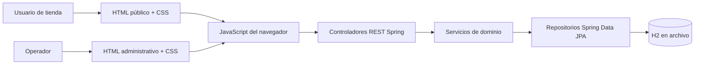

# Taller Buendía: documentación del sistema

**Estado documentado:** 3 de octubre de 2026  
**Propósito:** describir la estructura de referencia del proyecto, su evolución, la arquitectura actual, las funciones conectadas y el trabajo pendiente.

## 1. Resumen

Taller Buendía es un sistema web de comercio para productos artesanales. El proyecto conserva una interfaz HTML/CSS de varias páginas para la tienda pública y el panel administrativo. Se añadió una API REST con Spring Boot para persistir y procesar operaciones que antes se representaban con contenido estático. En desarrollo, Spring sirve tanto la API como los archivos web; los datos se guardan en una base H2 en archivo.

La guía visual y de navegación es el frontend de demostración del repositorio: páginas separadas por módulo, rutas HTML explícitas, estilos compartidos y formularios/tablas con la identidad del taller. Los cambios de integración buscan mantener esa organización y apariencia mientras las filas, formularios y acciones administrativas usan datos de la API. En el material disponible no aparece un archivo demo adicional independiente; si existe otro demo subido fuera de este repositorio, debe agregarse para poder comparar sus pantallas y estructura de manera directa.

## 2. Evolución del proyecto

### Etapa inicial: prototipo navegable

El sistema comenzó como un sitio estático con páginas para inicio, catálogo, detalle de producto, carrito, promociones, información del taller y contacto. El panel contiene páginas de acceso, perfil y módulos de Productos, Categorías, Artesanos, Clientes, Promociones/Descuentos, Pedidos, Pagos y Métricas. `css/estilos.css` comparte la presentación y `assets/` contiene imágenes.

En esta etapa las páginas definían la estructura y los recorridos visuales, pero buena parte de sus listados y acciones eran datos demostrativos. El formulario de acceso administrativo, por ejemplo, navega a la página de Productos y no implementa autenticación real.

### Etapa de integración

Se incorporó `backend/` como aplicación Spring Boot 3 con Java 17, Spring Web, Spring Data JPA, Bean Validation y H2. Se organizaron controladores, servicios, repositorios, entidades y DTO por dominio. Los scripts JavaScript de `public/js/` y `admin/js/` consumen las rutas `/api` y reemplazan o actualizan datos de referencia en las pantallas conectadas.

El historial de trabajo aportado por Copilot indica que se avanzó desde el flujo público de compra hasta conectar administración de catálogo, clientes, descuentos, pedidos, pagos y métricas. También reporta pruebas de integración contra H2, ajustes de datos derivados, limpieza de registros de prueba y una última revisión de enlaces “Ver”. Este documento describe el árbol actual; el relato de Copilot se toma como contexto de trabajo, no como garantía de que cada vista esté completamente terminada.

## 3. Estructura del repositorio

```text
.
├── public/                       # Tienda pública y flujo de pedidos
│   ├── index.html
│   ├── catalogo/                 # Productos, detalle, carrito y pago
│   ├── pedidos/                  # Confirmación, consulta y detalle
│   ├── artesanos/                # Presentación pública
│   ├── promociones/              # Promociones públicas
│   ├── nosotros/ contacto/ usuarios/
│   └── js/                       # Adaptadores de catálogo y pedidos
├── admin/                        # Panel administrativo multipágina
│   ├── productos/ categorias/ artesanos/ clientes/
│   ├── promociones/ pedidos/ pagos/ metricas/ perfil/ login/
│   └── js/                       # Adaptadores por módulo administrativo
├── css/estilos.css               # Estilos compartidos del demo
├── assets/                       # Imágenes y recursos estáticos
├── backend/
│   ├── pom.xml                   # Maven, dependencias y recursos estáticos
│   ├── src/main/java/com/tallerbuendia/api/
│   │   ├── catalogo/ clientes/ artesanos/ descuentos/
│   │   ├── pedidos/ pagos/ metricas/ dto/ config/ common/
│   │   └── HealthController.java
│   ├── src/main/resources/application.properties
│   ├── src/test/java/             # Pruebas automatizadas existentes
│   └── data/                      # Archivo local H2 (datos de desarrollo)
├── build-vercel.sh
└── vercel.json
```

La copia de recursos definida en Maven publica `public/` en la raíz estática, y `admin/`, `assets/` y `css/` bajo sus rutas correspondientes. Por eso el servidor local ofrece la tienda en `/` y el panel bajo `/admin/...`.

## 4. Arquitectura y responsabilidades



- **Presentación:** HTML multipágina y CSS del demo, conservando rutas y distribución por módulo.
- **Adaptadores de interfaz:** scripts que cargan y envían JSON mediante `fetch`; `window.API_BASE_URL` permite configurar el prefijo, cuyo valor por defecto es `/api`.
- **API:** controladores REST bajo `/api`; reciben parámetros/DTO y responden JSON.
- **Dominio:** servicios aplican reglas de negocio, por ejemplo validar stock, calcular descuentos, crear historial de estado y confirmar pagos.
- **Persistencia:** entidades JPA y repositorios; Hibernate actualiza el esquema de desarrollo (`ddl-auto=update`).
- **Semillas:** `DemoDataInitializer` carga datos demostrativos de categorías, artesanos, productos, clientes y descuento cuando las tablas correspondientes están vacías.

## 5. Módulos y estado funcional

| Módulo | Estado que muestra el código actual | Límites observados |
|---|---|---|
| Catálogo público | El adaptador consulta productos a la API; el carrito y los pasos de pedido usan scripts públicos. | Verificar detalles y promociones públicas individualmente; no asumir que todas las páginas informativas ya son dinámicas. |
| Productos | Listado y altas/ediciones administrativas conectadas; API ofrece CRUD, búsqueda y filtro por categoría. | Los enlaces de detalle deben comprobar que propaguen el ID seleccionado y no mantengan contenido de muestra. |
| Categorías | Listado, alta y edición conectados; CRUD disponible en API. | La existencia de una página de detalle no prueba que reciba el registro correcto. |
| Artesanos | Listado, alta y edición conectados; CRUD disponible en API. | Revisar la misma propagación de ID en detalles y relaciones con productos. |
| Clientes | Listado, búsqueda/filtro, alta y consulta por DNI. | El backend no expone actualización; `DELETE` realiza baja lógica. |
| Descuentos | API CRUD y adaptador administrativo; el inicializador puede agregar descuento de bienvenida si no hay registros. | Confirmar que las vistas de detalle/editado carguen por ID; la aplicación de descuento está en el cálculo del pedido. |
| Pedidos | Creación desde flujo de tienda, listado y consulta por DNI, detalle, historial y cambio de estado. | La consulta pública omite pedidos cancelados. No hay autenticación/autorización en las rutas administrativas. |
| Pagos | Registro asociado al pedido, listado/detalle y confirmación administrativa. | Es un registro interno de demostración, no una pasarela ni un cobro real. |
| Métricas | Endpoint agregado desde pedidos, pagos y productos; pantalla consume valores calculados. | Las métricas reflejan las reglas implementadas; no son un sistema contable ni un análisis histórico completo. |
| Perfil / acceso | Pantallas visuales y navegación del demo. | No existe autenticación, manejo de sesión ni autorización efectiva demostrada en el backend. |
| Contacto / contenido | Páginas informativas estáticas. | El formulario de contacto no demuestra envío persistente ni integración de correo. |

## 6. Flujo de compra y reglas principales

1. La tienda carga productos desde `GET /api/productos`.
2. El usuario prepara el carrito y completa sus datos de entrega.
3. `POST /api/pedidos` busca o crea al cliente por DNI, verifica stock, obtiene precio aplicable, descuenta unidades y persiste pedido, detalle e historial inicial.
4. El precio final puede considerar descuentos activos. El total del pedido se guarda con los precios unitarios calculados al momento de la compra.
5. `POST /api/pagos` asocia un pago pendiente y exige que el monto sea igual al total del pedido.
6. `PATCH /api/pagos/{id}/confirmar` confirma el pago y cambia el pedido a `PAGO_CONFIRMADO`, registrando el evento en seguimiento.
7. Desde administración se puede cambiar el estado del pedido. La lista pública de pedidos por DNI oculta pedidos cancelados.

Estados de pedido definidos: `PENDIENTE_PAGO`, `PAGO_CONFIRMADO`, `EN_PREPARACION`, `LISTO_PARA_ENTREGA`, `ENTREGADO` y `CANCELADO`. Al cancelar, el servicio repone las unidades de los detalles del pedido.

## 7. API REST actual

Prefijo local: `http://localhost:8080/api`.

| Recurso | Rutas principales | Uso |
|---|---|---|
| Salud | `GET /health` | Comprobar que la API responde. |
| Productos | `GET/POST /productos`, `GET/PUT/DELETE /productos/{id}` | Listar, filtrar con `categoriaId` o `q`, crear, editar y eliminar. |
| Categorías | `GET/POST /categorias`, `GET/PUT/DELETE /categorias/{id}` | CRUD de categorías. |
| Artesanos | `GET/POST /artesanos`, `GET/PUT/DELETE /artesanos/{id}` | CRUD de artesanos. |
| Clientes | `GET /clientes?q=&estado=`, `GET /clientes/{id}`, `GET /clientes/dni/{dni}`, `POST /clientes`, `DELETE /clientes/{id}` | Búsqueda, alta y baja lógica. |
| Descuentos | `GET/POST /descuentos`, `GET/PUT/DELETE /descuentos/{id}` | CRUD de descuentos. |
| Pedidos | `GET /pedidos?estado=`, `GET /pedidos/{id}`, `GET /pedidos/dni/{dni}`, `POST /pedidos`, `PATCH /pedidos/{id}/estado` | Alta, consulta y seguimiento. |
| Pagos | `GET/POST /pagos`, `GET /pagos/{id}`, `PATCH /pagos/{id}/confirmar` | Registro y confirmación manual. |
| Métricas | `GET /metricas` | Resumen calculado de ventas/pedidos/pagos/productos. |

Las respuestas de errores se centralizan en `common/ApiExceptionHandler`. Los cuerpos de las operaciones usan DTO bajo `dto/`; consultar las clases `*Request` y `*Response` para el esquema JSON vigente.

## 8. Modelo de datos

- **Cliente:** datos de contacto, DNI único, estado y baja lógica.
- **Producto:** nombre, descripción, material, precio, stock, estado, imagen, y relaciones con categoría y artesano.
- **Categoría:** nombre único, descripción y estado.
- **Artesano:** nombre, especialidad, años de experiencia, contacto y estado.
- **Descuento:** tipo, valor, vigencia, alcance/objetivo y estado.
- **Pedido:** código único, cliente, entrega, estado, total y fecha; contiene detalles.
- **Detalle de pedido:** producto, cantidad, precio unitario aplicado y subtotal.
- **Pago:** pedido, método, monto, estado, referencia y fecha.
- **Seguimiento de pedido:** historial de estados con observación y fecha.

H2 está configurada en archivo en `backend/data/taller-buendia`; se conserva tras reinicios. La consola de desarrollo está en `/h2-console`, URL JDBC `jdbc:h2:file:./data/taller-buendia`, usuario `sa` y contraseña vacía. No usar estas credenciales de desarrollo en producción.

## 9. Ejecución local

Requisitos: Java 17 o superior y Maven Wrapper incluido.

```bash
backend/mvnw -f backend/pom.xml spring-boot:run
```

Abrir `http://localhost:8080/` para la tienda. La API de salud responde en `http://localhost:8080/api/health`; el acceso visual de administración está en `http://localhost:8080/admin/login/login.html` (la pantalla no representa autenticación real).

La configuración principal está en `backend/src/main/resources/application.properties`. La base de datos es persistente: reiniciar la aplicación no la limpia automáticamente. Los datos semilla se insertan solo bajo las condiciones vacías verificadas por el inicializador.

## 10. Despliegue y configuración

El repositorio incluye `vercel.json` y `build-vercel.sh` para publicar el frontend estático. Ese despliegue no ejecuta por sí mismo el servidor Java. Para que una versión estática desplegada use la API, debe existir un backend accesible públicamente, configurar `window.API_BASE_URL` con su URL y resolver CORS/HTTPS en el servidor. En desarrollo, Spring sirve frontend y API desde el mismo origen.

## 11. Brechas y siguiente trabajo recomendado

1. **Comparar el demo fuente:** adjuntar o identificar el archivo de demo exacto si es distinto de las páginas actuales; verificar estructura, navegación, nombres y fidelidad visual antes de cambiar el diseño.
2. **Detalles administrativos:** asegurar que botones “Ver” y “Editar” transporten el ID de base de datos y que cada pantalla cargue ese registro, en lugar de depender de contenido fijo.
3. **Seguridad:** implementar autenticación, autorización por rol, protección de rutas y almacenamiento seguro de credenciales antes de usar el panel en producción.
4. **Pagos:** sustituir el flujo manual simulado por integración con proveedor de pagos si se requiere cobrar en línea; definir manejo de estados y confirmación segura.
5. **Validación de negocio:** revisar transiciones permitidas, repetición de cancelación/reposición de stock, límites de cantidades y disponibilidad concurrente.
6. **Persistencia de producción:** sustituir H2 por una base adecuada al despliegue, administrar migraciones de esquema, respaldos y secretos mediante configuración externa.
7. **Frontend y errores:** unificar mensajes de error/carga/vacío; confirmar que todas las vistas públicas de detalles/promociones consuman API donde corresponda.
8. **Pruebas:** ampliar cobertura de CRUD, validaciones, filtros, estados, descuentos, stock, métricas y flujos de interfaz. Hay una prueba de integración `ApiSmokeTest`; una ejecución de pruebas no forma parte de esta revisión documental.
9. **Accesibilidad y calidad visual:** comprobar formularios, tablas, responsive, contraste, etiquetas y navegación por teclado manteniendo el patrón del demo.

## 12. Archivos de referencia

- `backend/README.md`: instrucciones breves de ejecución y resumen de rutas.
- `backend/pom.xml`: versión de Spring Boot, dependencias y ensamblado de recursos web.
- `backend/src/main/java/com/tallerbuendia/api/`: API, lógica y modelo.
- `backend/src/main/java/com/tallerbuendia/api/config/DemoDataInitializer.java`: datos semilla.
- `admin/js/` y `public/js/`: adaptadores de interfaz.
- `css/estilos.css`, `assets/`, `admin/` y `public/`: estructura visual de referencia del sistema.
- Texto de Copilot aportado en la conversación: registro narrativo del trabajo previo y sus verificaciones reportadas.
